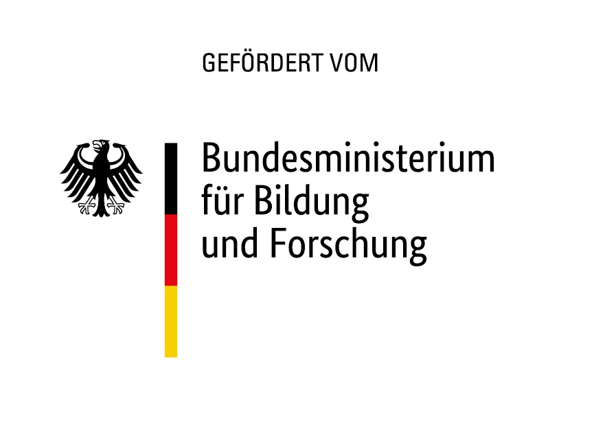

### Abstract

The EDV-TEK project aims to investigate four key sub-dimensions of technology research, specifically identification, emergence, diffusion, and exploitation, within the context of climate change mitigation technologies.

In terms of identification, the project is utilizing Artificial Intelligence techniques to train Neural Networks that automate the process of patent classification. This field of research is relatively new and thus, the results obtained from different studies are often not comparable.

In terms of emergence, the project is exploring the role of science in technological developments, with a specific focus on measuring the scientific influence and origin of knowledge by examining citations from patents to scientific publications.

In terms of diffusion, the project is using citations in patents as a measure of knowledge flow and knowledge recombination. Furthermore, the study will focus on the interrelatedness of diffusion, impact, and novelty.

In terms of exploitation, the project is focusing on the commercialization of technologies, using technology startups as the object of study. Research has shown that patents positively influence the performance of startups, yet there is limited knowledge about the explicit technologies and their corresponding novelty level. The EDV-TEK project aims to address this gap by utilizing machine-learning neural networks to analyze the underlying phenomena.

